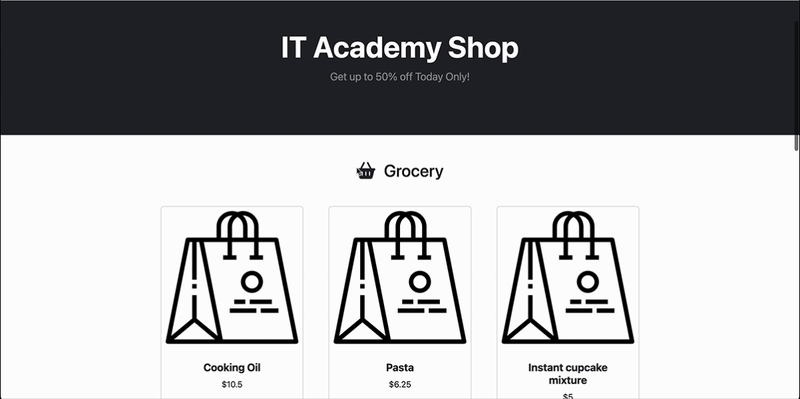
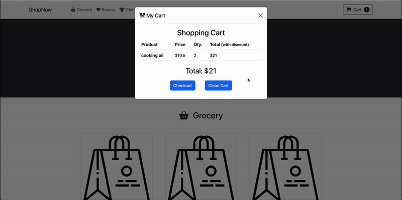
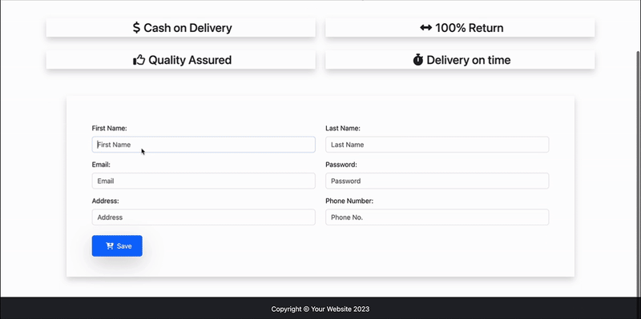

# 🛒 Sprint 2 - E-Commerce – Level 1

This is a front-end project created as part of ITACADEMY Front-End Bootcamp. The goal is to implement a basic shopping cart experience using vanilla JavaScript. The user can add and remove items, apply discounts, and validate a checkout form. No back-end or API integration is used; all data is hardcoded.

Each exercise was developed in its own feature branch, following this convention:  
`level-1/exercise-#`.

---

## 🚀 Technologies Used

- HTML, CSS (Bootstrap for some styles).
- Vanilla JavaScript
- RegEx for form validation

---

## 🗂️ Project Structure

```
📁 css
   └── styles.css

📁 images
   ├── favicon.ico
   └── product.svg

📁 js
   ├── checkout.js
   ├── dummyData.js
   └── shop.js

.gitignore
checkout.html
index.html
README.md
```

## ✅ Exercises Overview

### 🧩 Exercise 1: Add Products to Cart

- Implemented the `buy()` function, which allows users to add products to the cart.
- Used an object-based approach with a `getSubtotal()` method inside each product.
- Each product tracks its own quantity and subtotal.
- If the product already exists in the cart, the quantity is incremented and discount recalculated.

📸 **Demo**  

---

### 🧹 Exercise 2: Clean Cart

- Created a reusable `updateHTML()` function to clean up and update repetitive DOM updates.
- `cleanCart()` resets the cart array and uses `updateHTML()` to clear UI content.

**Design Decision:**  

- Instead of reassigning the `cart` variable to a new empty array, I used `cart.length = 0` to preserve the original array reference. This helps maintain consistency if other parts of the application rely on the same `cart` instance.
- Originally created a separate function (`removeHTML`) for clearing content, but then refactored to a general-purpose utility called `updateHTML()` to follow DRY principles.

---

### ➕ Exercise 3: Calculate Cart Total

- Implemented a `calculateTotal()` function that loops through the cart.
- Used the nullish coalescing operator `??` to choose between discounted and regular subtotal.

---

### 🏷️ Exercise 4: Apply Promotions

- Implemented logic to apply two types of discounts:
  - Buy 3+ cooking oils → 20% off
  - Buy 10+ cupcake mixtures → 30% off
- Discounts are applied dynamically and saved in a new `subTotalWithDiscount` property.
- The function `calculateDiscount()` is called only when quantities update.

📸 **Demo Discounts**  


---

### 🖼️ Exercise 5: Display the Cart in Modal

- Created DOM elements using `createElement()` rather than injecting HTML directly, for better structure and safety.
- Split responsibilities:
  - `createCartRow()` builds the row structure.
  - `addProductToCart()` appends rows to the cart modal.
  - `updateProductInCart()` updates quantity and subtotal when products are modified.

**Design Decision:**  
 While more verbose, this approach ensures better control and maintainability over the cart’s dynamic content.

📸 **Demo of Exercise 5 feature**  


---

### 📋 Exercise 6: Checkout Form Validation

- Implemented on-change field validation for immediate feedback.
- Used regular expressions to validate:
  - Name/surname (letters only)
  - Phone number (9 digits)
  - Email format
  - Passwords (must include at least one number and one letter)
- Validations also run on form submission.

**Design Decision:**  
Chose inline (with onChange event) validation to enhance user experience and deliberately practiced using RegEx.

📸 **Demo in-line validations**  


---

## 🧠 Key Learnings

- How to manipulate the DOM with `createElement` for structured rendering.
- Managing product state with methods and custom properties.
- Creating reusable utilities to reduce redundancy.
- Implementing form validation logic using JavaScript and RegEx.
- Use branches and Pull Request to merge them.

---

## 🪄 Future Improvements

- Use `try...catch` blocks to ensure that unexpected errors (e.g. missing DOM elements) don’t crash the app.
